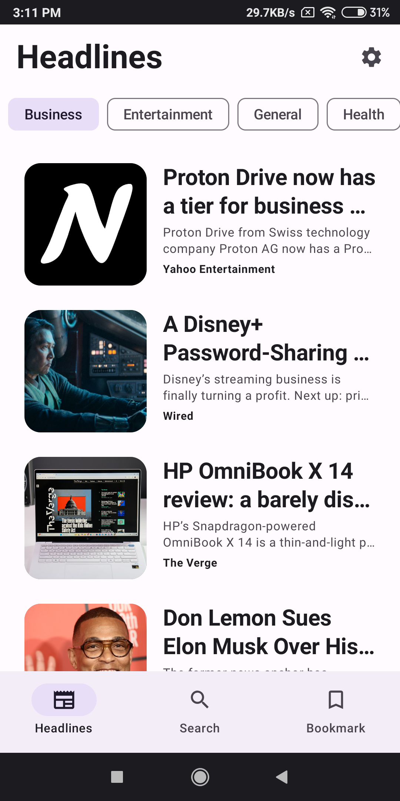
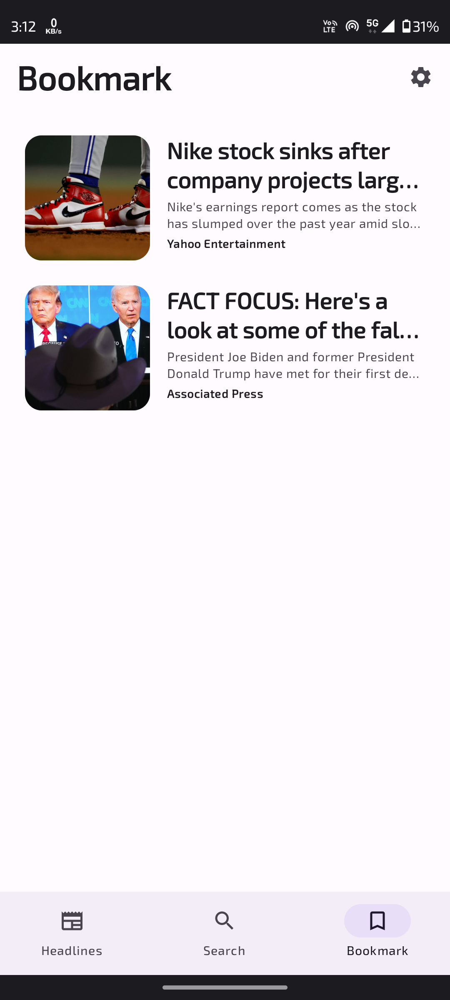
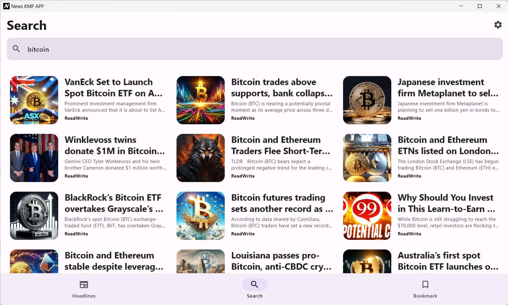

# News Kotlin Multiplatform App ✨

[](https://youtu.be/Dq1jcsVQmtY?si=nU6pnpR9jpuy0Cw5)

Click the image above to watch a demo of the News Kotlin Multiplatform App on YouTube.

## Overview

The News KMP App is a Kotlin Compose Multiplatform (KMP) project that aims to provide a consistent news reading
experience across multiple platforms, including Android, iOS, Windows, macOS, and Linux. This project leverages Kotlin's
multiplatform capabilities to share code and logic while using Compose for UI, ensuring a seamless and native experience
on each platform.

## Features & Technologies:

* Explore Top News Headlines:
    * Stay updated with the day's top news stories effortlessly.
* Read Detailed Content:
    * Dive deeper into your favorite news articles for comprehensive insights.
* Personalized Search:
    * Easily find news articles tailored to your interests.
* Save for Later:
    * Bookmark articles to read offline and enjoy uninterrupted reading pleasure.
* Cross-Platform Support:
    * Seamless operation on Android, iOS, Windows, macOS, and Linux.
* Declarative UI with Jetpack Compose
    * Shared UI components across Android and desktop.
    * Material Design and Material Design 3 support.
* Smooth Navigation & State Management:
    * Simple navigation using Jetpack Compose Navigation.
* MVVM Architecture:
    * Model-View-ViewModel pattern for separation of concerns.
    * ViewModel management for UI-related data.
* Robust Networking:
    * HTTP client-server communication with Ktor.
    * JSON serialization/deserialization and content negotiation.
* Efficient Image Loading:
    * Image loading and caching with Coil.
* Local Data Storage:
    * Local database management with Room for all platform.
    * Key-value pair storage with DataStore.
* Build Configuration Management:
    * Centralized build configurations using BuildKonfig.

## Libraries 🛠️

- [BuildKonfig](https://github.com/yshrsmz/BuildKonfig) - BuildConfig for Kotlin Multiplatform Project. It currently
  supports embedding values from gradle file.
- [Ktor](https://ktor.io/docs/http-client-multiplatform.html) - Provides multiplatform libraries required to make
  network calls to the REST API.
- [Kermit](https://github.com/touchlab/Kermit) - Kermit by Touchlab is a Kotlin Multiplatform centralized logging
  utility.
- [Room](https://developer.android.com/kotlin/multiplatform/room) - The Room persistence library provides an abstraction
  layer over SQLite to allow for more robust database access while harnessing the full power of SQLite.
- [DataStore](https://developer.android.com/kotlin/multiplatform/datastore) - The DataStore library stores data
  asynchronously, consistently, and transactionally, overcoming some of the drawbacks of SharedPreferences
- [Navigation](https://www.jetbrains.com/help/kotlin-multiplatform-dev/compose-navigation-routing.html) Navigation is a
  key part of UI applications that allows users to move between different application screens.
- [kotlinx.coroutines](https://github.com/Kotlin/kotlinx.coroutines) - Library support for Kotlin coroutines with
  multiplatform support.
- [Common ViewModel](https://www.jetbrains.com/help/kotlin-multiplatform-dev/compose-viewmodel.html) The Android
  ViewModel approach to building UI can be implemented in common code using Compose Multiplatform.
- [kotlinx.serialization](https://github.com/Kotlin/kotlinx.serialization) - Provides sets of libraries for various
  serialization formats eg. JSON, protocol buffers, CBOR etc.

## Getting Started

### Installation 🛠️

1. Clone this repository:
   ```bash
   git clone https://github.com/Coding-Meet/News-KMP-App.git
   ```

2. Open in the latest version of Android Studio or intellij idea.
3. Before running the project, obtain an API key from [News Api](https://newsapi.org/) .
4. Add a `local.properties` file to the project root.
5. Place your News API key in `local.properties` file as `API_KEY` property.

```properties
API_KEY=YOUR_API_KEY
```

### Run the app on your device or emulator:

- For Android, run the `composeApp` module by selecting the `app` configuration. If you need help with the
  configuration, follow this link
  for [android](https://www.jetbrains.com/help/kotlin-multiplatform-dev/compose-multiplatform-create-first-app.html#run-your-application-on-android)
- For iOS, run the `composeApp` module by selecting the `iosApp` configuration. If you need help with the configuration,
  follow this link
  for [Ios](https://www.jetbrains.com/help/kotlin-multiplatform-dev/compose-multiplatform-create-first-app.html#run-your-application-on-ios)
- For Desktop, run `./gradlew :composeApp:run`

## Screenshot 💻

## Android

<table>
   <tr>
    <td></td>
    <td></td>
   </tr>
   <tr>
    <td></td>
    <td></td>
   </tr>
   <tr>
    <td></td>
    <td></td>
   </tr>
   <tr>
    <td></td>
    <td></td>
       </tr>
   <tr>
    <td></td>
    <td></td>
   </tr>
   <tr>
    <td></td>
    <td></td>
   </tr>
</table>

## IOS

<table>
   <tr>
    <td></td>
    <td></td>
   </tr>
   <tr>
    <td></td>
    <td></td>
   </tr>
   <tr>
    <td></td>
    <td></td>
   </tr>
   <tr>
    <td></td>
    <td></td>
       </tr>
   <tr>
    <td></td>
    <td></td>
   </tr>
</table>

## Window

<table>
  <tr>
    <td></td>
      </tr>
  <tr>
  <tr>
    <td></td>
      </tr>
  <tr>
    <td></td>
  </tr>
  <tr>
    <td></td>
      </tr>
  <tr>
    <td></td>
  </tr>
  <tr>
    <td></td>
      </tr>
  <tr>
    <td></td>
  </tr>
  <tr>
    <td></td>
      </tr>
  <tr>
    <td></td>
  </tr>
  <tr>
    <td></td>
      </tr>
  <tr>
    <td></td>
  </tr>
  <tr>
    <td></td>
  </tr>
</table>

## Contributing 🤝

Feel free to contribute to this project by submitting issues, pull requests, or providing valuable feedback. Your
contributions are always welcome! 🙌

## ❤ Show your support

Give a ⭐️ if this project helped you!

<a href="https://www.buymeacoffee.com/codingmeet" target="_blank">

</a>

Your generosity is greatly appreciated! Thank you for supporting this project.

## Connect with me

[](https://youtube.com/@CodingMeet26?si=FuKwU-aBaf_5kukR)
[](https://www.linkedin.com/in/coding-meet-a74933273/)
[](https://twitter.com/CodingMeet)

## Author

**Meet**